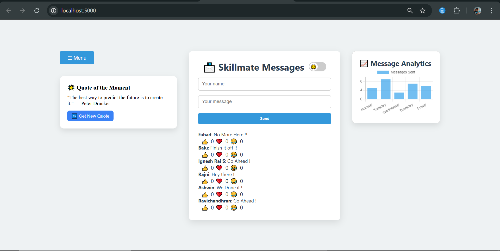
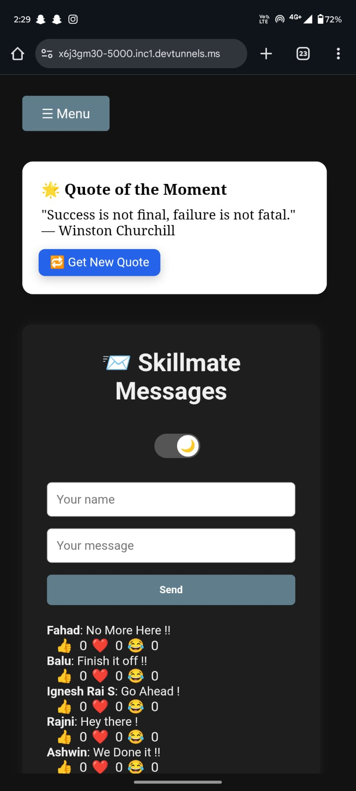

# 📬 Skillmate Message Board

A dynamic and interactive message board web app developed during the **Skillmate Platform Contributor Challenge**.  
It allows users to post messages, view inspirational quotes, track activity via charts, and persist data using MongoDB.

---

## 🧰 Tech Stack

- **Frontend**: HTML / CSS / JavaScript  
- **Backend**: Node.js / Express  
- **Database**: MongoDB (using Mongoose)  
- **Visualization**: Chart.js  
- **Version Control**: Git & GitHub

---

## 🎯 Features

- 📝 Post messages with name and text, saved to MongoDB  
- 🌙 Toggle between Light/Dark Mode with animation  
- 😂 Emoji Reactions per message (👍 ❤️ 😂)  
- 🔔 Toast Notifications on message send/validation  
- 📈 Chart.js-based analytics dashboard  
- 💬 Random quote generator  
- 💾 Messages are stored and retrieved from MongoDB  
- 📱 Fully responsive UI (mobile-friendly)  
- 🧱 Modular JavaScript code and backend routes

---

## 🚀 Installation

Clone the repo and install dependencies:

bash script

git clone https://github.com/your-username/my-skillmate-project.git

cd my-skillmate-project

Run:

npm install

## ▶️ Run the App

Ensure MongoDB is running locally or provide a MongoDB Atlas URI in .env:

MONGODB_URI=your-mongodb-connection-string
PORT=5000
Then start the backend and frontend:

## Start the backend server

npm start

## Open frontend

open index.html   # macOS

start index.html  # Windows

## 📸 Screenshots

### 💻 Desktop View  

### 📱 Mobile View  

## 🔍 Known Bugs

⚠️ No user authentication yet

⚠️ Emojis are not stored in the database (client-only reactions)

## 📦 Future Scope

👤 Add login / user tracking

💌 Filter messages by user

🧠 Store emoji reactions in the database

🔍 Add search/filtering capability

📂 Export chat logs to PDF or JSON

## 👨‍💻 Author

Ignesh Rai

Made with ❤️ at Skillmate

Built during the ##Skillmate Platform Contributor## challenge using MongoDB, Node.js, and creativity! 🎯
